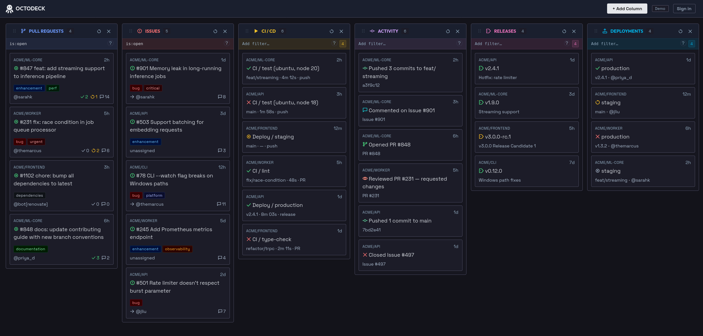

# Octodeck

**TweetDeck for GitHub.** Monitor pull requests, issues, CI status, notifications, and activity across your repos — all from one configurable dashboard.



**[octodeck.pages.dev](https://octodeck.pages.dev)**

## What it looks like

Each column tracks one type of GitHub activity. You can have as many columns as you like, in any order, each filtered however you want.

**Column types:**

- **Pull Requests** — open/draft/merged/closed PRs with review status, approval count, labels, and comment count
- **Issues** — open/closed issues with assignee, labels, and comment count
- **CI/CD** — workflow runs with pass/fail/running status, branch, duration, and trigger type
- **Activity** — a feed of events (commits, comments, reviews, stars, forks, etc.)
- **Releases** — tagged releases marked stable or pre-release
- **Deployments** — deployment status per environment

**Customisation:**

- Add, remove, and drag columns to reorder them
- Edit each column's title, filter query, and (for CI/Releases/Deployments) the list of repos it watches
- Filter queries use GitHub search syntax — e.g. `involves:@me is:open` or `repo:owner/repo label:bug`
- Each column has its own accent color

**Getting started:**

Sign in with GitHub to load your real data, or click **Continue in Demo Mode** to explore with sample data first.

## For developers

**Stack:** React 19 (via Preact shim) + TypeScript + Vite, Zustand for state, SWR for data fetching, CSS Modules with OKLCH design tokens. Auth backend is Cloudflare Pages Functions (in `functions/api/`).

### Setup

1. Install dependencies:

   ```bash
   npm install
   ```

2. Create a GitHub OAuth app and copy `.dev.vars.example` to `.dev.vars`, filling in your credentials:

   ```
   GITHUB_CLIENT_ID=...
   GITHUB_CLIENT_SECRET=...
   ALLOWED_ORIGIN=http://localhost:5173
   SESSION_CRYPTO_KEY=...  # openssl rand -base64 32 | tr '+/' '-_' | tr -d '='
   ```

3. Set `VITE_GITHUB_CLIENT_ID` in a `.env.local` file to match.

4. Start the frontend and backend dev servers in separate terminals:

   ```bash
   npm run dev          # → http://localhost:5173
   npm run dev:api      # → http://localhost:8788 (Wrangler)
   ```

   Vite proxies `/api/*` requests to the Wrangler dev server automatically.

### Commands

```bash
npm run dev      # Start Vite dev server
npm run dev:api  # Start Cloudflare Workers dev server (Wrangler)
npm run build    # TypeScript check + Vite build
npm run lint     # Lint with oxlint
npm run format   # Format with oxfmt
npm test         # Run tests (Vitest)
npm run preview  # Preview production build
```

### Security

**OAuth flow**

Octodeck uses the GitHub OAuth 2.0 Authorization Code flow with PKCE, brokered through a Cloudflare Pages Functions backend so that the client secret never touches the browser.

1. `/api/login` generates a random PKCE `code_verifier` and `state`, stores them encrypted in an `__Host-pkce` cookie (HttpOnly, 10-minute TTL), and redirects to `github.com/login/oauth/authorize`.
2. GitHub redirects back to `/api/callback` with a `code` and `state`. The backend verifies the state matches, decrypts the PKCE cookie, and exchanges the code + `code_verifier` for a token pair directly with GitHub.
3. The resulting access token and refresh token are encrypted with AES-GCM (using `SESSION_CRYPTO_KEY`) and stored in an `__Host-session` cookie (HttpOnly, Secure, SameSite=Strict). The browser never sees the raw tokens.
4. The frontend calls `/api/session` to receive the access token for in-memory use. All session endpoints require a CSRF token passed as the `X-GitHub-App-CSRF` request header, read from a separate non-HttpOnly `__Host-csrf` cookie (a [cookie-to-header CSRF pattern](https://cheatsheetseries.owasp.org/cheatsheets/Cross-Site_Request_Forgery_Prevention_Cheat_Sheet.html#double-submit-cookie)).

**OAuth scopes requested**

| Scope             | Why it's needed                                                                               |
| ----------------- | --------------------------------------------------------------------------------------------- |
| `repo`            | Read PRs, issues, CI workflow runs, deployments, and releases across public and private repos |
| `notifications`   | Read your GitHub notification feed                                                            |
| `read:user`       | Read your GitHub username/avatar for the signed-in user display                               |
| `security_events` | Read Dependabot/code-scanning alerts (used by the activity feed)                              |

No write scopes are requested. Octodeck is read-only.

**Token storage**

Tokens are never written to `localStorage` or `sessionStorage`. The access token lives only in memory (Zustand store); the session cookie is HttpOnly so JavaScript cannot read it.

### Deployment

The app deploys to Cloudflare Pages. The `functions/api/` directory is picked up automatically as Pages Functions. Set the production secrets in the Cloudflare dashboard.
